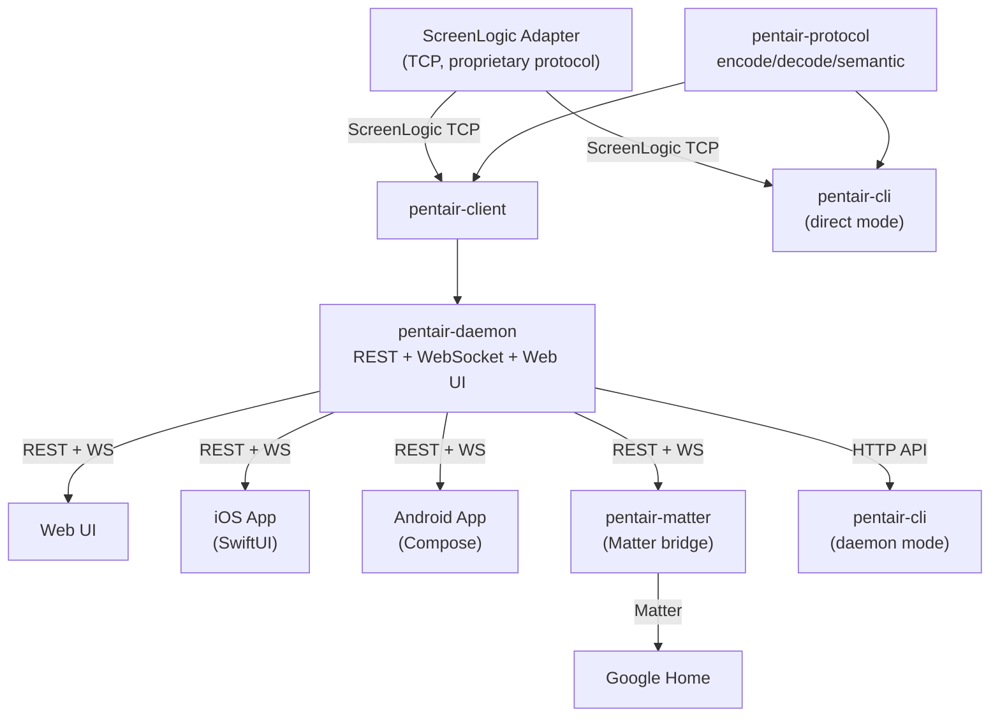

<p align="center"></p>

<h1 align="center">Pentair Pool Controller</h1>

<p align="center">
  
  
  
  
</p>

<p align="center">
  A full-stack smart pool controller built from a reverse-engineered wire protocol. One Rust daemon talks to your Pentair hardware, serves a web dashboard, powers native mobile apps, and bridges to Google Home via Matter.
</p>

---

<h3 align="center">One scenario. Every surface.</h3>

<p align="center">
  
  &nbsp;&nbsp;&nbsp;&nbsp;
  
  &nbsp;&nbsp;&nbsp;&nbsp;
  
</p>

<p align="center"><em>Tap "warm the spa to 104" on any device. Watch it heat up in real time. Get a notification when it's ready.</em></p>

<!-- TODO: Add GIF demo once captured -->
<!-- <p align="center"></p> -->

## What it does

|  | Feature | Details |
|--|---------|---------|
| **Protocol** | Reverse-engineered wire protocol | Binary encode/decode, semantic model, zero vendor SDK. Tested against 24 captured packet fixtures. |
| **Daemon** | REST + WebSocket server | Auto-discovers your adapter via UDP broadcast. Semantic API, embedded web UI, smart behaviors (jets auto-enable spa, spa-off kills jets). |
| **Mobile** | Native iOS + Android apps | SwiftUI and Jetpack Compose. Real-time updates via WebSocket. Push notifications when your spa is ready, with heating ETA. |
| **Google Home** | Matter bridge sidecar | Spa thermostat, jets, 12 IntelliBrite light modes. "Hey Google, warm the spa." Zero daemon changes needed. |

## Architecture



**Tested on:** IntelliTouch controller, IntelliFlow VS pump, IntelliBrite lights, firmware 5.2 Build 738.0.

## Quick Start

### 1. Build and run the daemon

```bash
cargo build --release -p pentair-daemon
cargo run -p pentair-daemon  # auto-discovers adapter on LAN
```

The daemon advertises itself via mDNS. Mobile apps find it automatically.

### 2. CLI

```bash
# Direct mode (talks to adapter, no daemon needed)
cargo run -p pentair-cli -- --direct --host 192.168.1.89 status

# Daemon mode (default, talks to daemon HTTP API)
cargo run -p pentair-cli -- status
cargo run -p pentair-cli -- circuit on "Pool"
cargo run -p pentair-cli -- heat set spa 102
cargo run -p pentair-cli -- light party
```

### 3. Mobile apps

**Android:**
```bash
cd pentair-android
./gradlew app:assembleDebug app:testDebugUnitTest
```

**iOS** (requires macOS + Xcode):
```bash
cd pentair-ios
xcodebuild -project PentairIOS.xcodeproj -scheme PentairIOS \
  -destination "platform=iOS Simulator,name=iPhone 17 Pro" build
```

## Repo Structure

| Directory | Description |
|-----------|-------------|
| `pentair-protocol/` | Wire protocol: types, encode/decode, semantic model (no IO) |
| `pentair-client/` | Async TCP/UDP client (tokio) |
| `pentair-daemon/` | Long-running service: REST API, WebSocket, web UI, heating estimator, push notifications |
| `pentair-cli/` | Command-line tool (direct to adapter or via daemon) |
| `pentair-matter/` | Matter bridge sidecar for Google Home |
| `pentair-android/` | Android app (Kotlin + Jetpack Compose) |
| `pentair-ios/` | iOS app (SwiftUI) |
| `docs/` | Protocol reference, API spec, design docs |
| `test-fixtures/` | 24 binary captures from live hardware |

## Semantic API

The daemon exposes a semantic pool API at `GET /api/pool` that auto-discovers pool topology from pump speed tables and circuit function codes. The response is human-friendly JSON (pool, spa, lights, auxiliaries, pump, system) with no protocol internals.

Write endpoints use semantic identifiers:

```
POST /api/spa/on
POST /api/spa/off
POST /api/spa/heat          {"setpoint": 104}
POST /api/spa/jets/on
POST /api/pool/on
POST /api/pool/off
POST /api/lights/mode       {"mode": "caribbean"}
POST /api/devices/register  {"token": "fcm-token"}
GET  /api/ws                WebSocket for real-time state push
```

Smart behaviors: jets auto-enables spa, spa-off disables jets, light mode tracked by daemon. Pool and spa include `active: bool` (circuit on AND pump running with RPM > 0).

See [docs/api-spec.md](docs/api-spec.md) for the full API reference.

## Push Notifications

The daemon sends FCM push notifications for spa heating milestones:

- **Heating Started** -- spa heater engaged
- **Estimate Ready** -- ETA calculated (e.g., "ready in about 18 min")
- **Halfway** -- 50% of the way to target temperature
- **Almost Ready** -- 90% of the way
- **At Temperature** -- spa has reached the setpoint

Heating ETA is computed server-side by combining configured heater specs, learned rates from prior sessions, and live observed data.

## Setup After Cloning

### Firebase config (required for mobile apps)

Download Firebase config files from the [Firebase Console](https://console.firebase.google.com) -> Project Settings -> Your Apps:

- **Android**: Download `google-services.json` -> place at `pentair-android/app/google-services.json`
- **iOS**: Download `GoogleService-Info.plist` -> place at `pentair-ios/PentairIOS/GoogleService-Info.plist`

These files are gitignored to keep API keys out of the public repo.

### Daemon FCM key (required for push notifications)

1. Firebase Console -> Project Settings -> Service Accounts -> Generate New Private Key
2. Save to `~/.pentair/firebase/<project-id>-pentair-daemon-fcm.json`
3. Reference in your daemon config:
   ```toml
   [fcm]
   project_id = "your-project-id"
   service_account = "~/.pentair/firebase/your-project-id-pentair-daemon-fcm.json"
   ```

## Testing

```bash
cargo test --workspace                # All unit tests (209 passing)

# Live hardware tests (require adapter on LAN)
PENTAIR_HOST=192.168.1.89 cargo test --test live_read -p pentair-client -- --ignored --test-threads=1
PENTAIR_HOST=192.168.1.89 cargo test --test live_write -p pentair-client -- --ignored --test-threads=1
```

Live write tests save/restore state automatically. If restoration fails, a loud panic shows what to fix manually.

## Documentation

- [Protocol Reference](docs/protocol-reference.md) -- byte-level wire format with verification status
- [API Spec](docs/api-spec.md) -- REST and WebSocket API
- [Architecture](ARCHITECTURE.md) -- system design details
- [Smart Pool Platform Vision](docs/designs/smart-pool-platform.md) -- product roadmap
- [Heat-Up Estimation](docs/designs/heat-up-estimation.md) -- how ETA is computed

## Design Principles

- **Daemon is the source of truth** for semantics, temperature trust, heating estimates, and display state. Mobile apps are intentionally thin.
- **No hardcoded server URLs** in any client code. Daemon discovered via mDNS/Bonjour.
- **Protocol library has zero IO dependencies** -- testable with byte slices, reusable in embedded/WASM.
- **Mutating live tests use snapshot/restore** -- read state before, restore after, Drop guard on panic.
