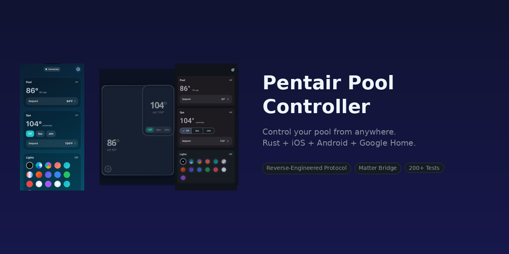
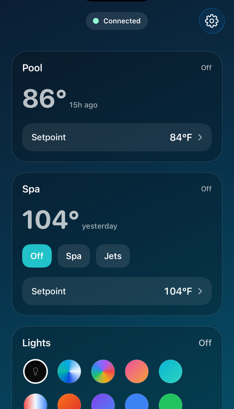
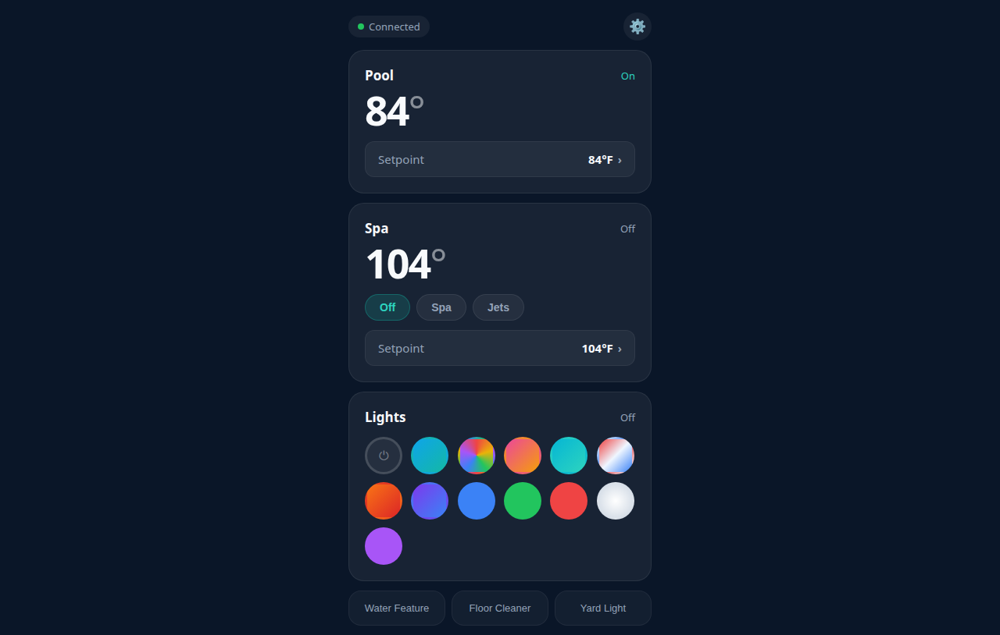
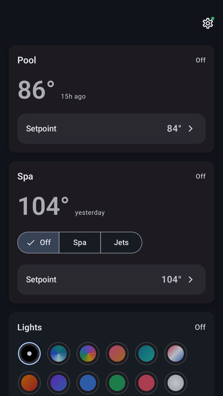
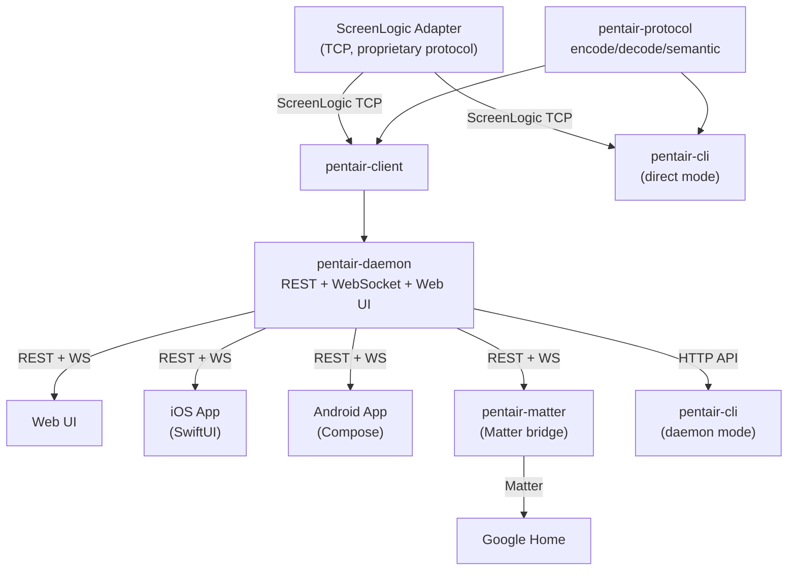

<p align="center"></p>

<h1 align="center">Pentair Pool Controller</h1>

<p align="center">
  
  
  
  
</p>

<p align="center">
  Pool, spa, lights, heater. That's what you actually use. This project gives you a simple, unified interface to all of it -- phone, web, Google Home, voice -- without touching the Pentair app or the wall panel.
</p>

---

<h3 align="center">One scenario. Every surface.</h3>

<p align="center">
  
  &nbsp;&nbsp;&nbsp;&nbsp;
  
  &nbsp;&nbsp;&nbsp;&nbsp;
  
</p>

<p align="center"><em>Tap "warm the spa to 104" on any device. Watch it heat up in real time. Get a notification when it's ready.</em></p>

## Why this exists

Pentair pool systems are powerful hardware with terrible software. The ScreenLogic app is slow, unreliable, and can't talk to anything else. The wall panel works but you have to walk outside. There's no Google Home integration, no push notifications, no heating ETA.

This project fixes all of that by talking directly to the ScreenLogic adapter over your LAN. It reverse-engineers the binary protocol, wraps it in a clean semantic API, and exposes it everywhere: a web dashboard, native iOS and Android apps, a Google Home bridge, and a CLI.

**The key design decision:** instead of exposing every circuit, schedule, and configuration option, we model the things people actually care about. Pool on/off. Spa on/off. Jets. Lights with color modes. Temperature and heating setpoints. That's it. Smart behaviors handle the rest -- turning on jets automatically enables the spa, turning off the spa kills the jets, light modes are tracked across sessions.

If you have a Pentair IntelliTouch or EasyTouch system with a ScreenLogic adapter on your network, this just works.

## Quick Start

### What you need

- A **Pentair IntelliTouch or EasyTouch** system with a **ScreenLogic adapter** on your LAN
- An always-on machine on the same network (Linux, Mac, Raspberry Pi, etc.)
- Rust toolchain: `curl --proto '=https' --tlsv1.2 -sSf https://sh.rustup.rs | sh`

### Step 1: Build and start the daemon

```bash
git clone https://github.com/scottmsilver/pentair.git
cd pentair
cargo build --release --workspace
cargo run --release -p pentair-daemon
```

You should see something like:

```
starting pentair-daemon, binding to 0.0.0.0:8080
connecting to adapter...
connected to ScreenLogic adapter at 192.168.1.89:80
```

If the daemon can't find your adapter, set the host explicitly: `PENTAIR_HOST=192.168.1.89 cargo run --release -p pentair-daemon`

### Step 2: Check the web dashboard

Open **http://localhost:8080** in a browser. You should see your pool and spa temperatures, light controls, and the current state of your system. Try toggling something -- it should respond within a second.

### Step 3: Add Google Home (optional)

```bash
# In a second terminal, start the Matter bridge
cargo run --release -p pentair-matter
```

1. Open **http://localhost:8080/matter** to see the pairing QR code
2. In the Google Home app: **Add device** -> **New device** -> **Matter-enabled device**
3. Scan the QR code (or enter manual code `3497-0112-332`)

Your pool devices (spa, pool, jets, lights, goodnight) will appear in Google Home. Try: "Hey Google, set Pool Light to blue."

**First time setup:** You need a project in the [Google Home Developer Console](https://console.home.google.com/) with test VID `0xFFF1` and PID `0x8001`. See the [Google Home / Matter](#google-home--matter) section below for details.

### Step 4: Set up mobile apps (optional)

Both apps auto-discover the daemon via mDNS -- no IP address to configure.

**Android:**
```bash
cd pentair-android
./gradlew app:assembleDebug app:installDebug
```

**iOS** (requires macOS + Xcode):
```bash
cd pentair-ios
open PentairIOS.xcodeproj  # build and run from Xcode
```

The apps need a Firebase project for push notifications. See [Setup After Cloning](#setup-after-cloning) for config files.

### Step 5: Set up remote access (optional)

To control your pool from outside the house:

1. **Expose the daemon** through a tunnel. The simplest options:
   - [Cloudflare Tunnel](https://developers.cloudflare.com/cloudflare-one/connections/connect-networks/): `cloudflared tunnel --url http://localhost:8080`
   - [Tailscale](https://tailscale.com/): install on the daemon machine and access via Tailscale IP
   - Any reverse proxy (Caddy, nginx) with a domain and TLS

2. **Set up Firebase Auth** for the web UI:
   - Create a Firebase project, enable Google Sign-In
   - Update the Firebase config in `static/index.html` with your project's credentials
   - Set the hostname check to your domain

3. **Approve users from home** -- when someone signs in remotely for the first time, they'll see an approval prompt. Open the approval link from any device on your home WiFi to approve them.

### Step 6: Run on boot (optional)

Create a systemd service so the daemon starts automatically:

```bash
sudo tee /etc/systemd/system/pentair-daemon.service << 'EOF'
[Unit]
Description=Pentair Pool Daemon
After=network-online.target
Wants=network-online.target

[Service]
ExecStart=/path/to/pentair/target/release/pentair-daemon
Restart=always
User=your-username
Environment=RUST_LOG=info

[Install]
WantedBy=multi-user.target
EOF

sudo systemctl enable --now pentair-daemon
```

For the Matter bridge, create a similar service for `pentair-matter`.

## What you get

|  | Feature | How it works |
|--|---------|-------------|
| **Web UI** | Embedded dashboard | Served at `:8080`. Pool, spa, lights, temperature. Dark theme, mobile-friendly. No build step, no npm. |
| **iOS + Android** | Native apps | SwiftUI and Jetpack Compose. Auto-discover daemon via mDNS. Real-time WebSocket updates. Push notifications with heating ETA. |
| **Google Home** | "Hey Google, warm the spa" | Matter bridge exposes spa, pool, jets, lights, and goodnight as Google Home devices. Color wheel for IntelliBrite light modes. |
| **Remote access** | Control from anywhere | Web UI works over a tunnel (Cloudflare, Tailscale, etc.) with Firebase Google Sign-In. LAN self-approval: approve remote access from any device already on your home network. |
| **Push notifications** | "Spa is ready" | FCM (Android) and APNs Live Activities (iOS). Milestones: heating started, ETA ready, halfway, almost ready, at temperature. |
| **CLI** | `pentair-cli heat set spa 104` | Direct mode (talks to adapter) or daemon mode (talks to HTTP API). |

## Semantic API

The daemon auto-discovers your pool topology from pump speed tables and circuit function codes. No configuration needed -- it figures out what you have and gives you a clean JSON API:

```
GET  /api/pool                Full pool state (pool, spa, lights, pump, system)
POST /api/spa/on              Turn on spa (pump starts, heater engages)
POST /api/spa/heat            {"setpoint": 104}
POST /api/spa/jets/on         Jets on (auto-enables spa)
POST /api/pool/on             Pool circulation on
POST /api/lights/mode         {"mode": "caribbean"}
POST /api/goodnight           All-off scene
GET  /api/ws                  WebSocket for real-time state push
```

Smart behaviors are built in: jets auto-enable spa, spa-off kills jets, light mode is tracked by the daemon. Pool and spa include `active: bool` (circuit is on AND the pump is actually running with RPM > 0).

See [docs/api-spec.md](docs/api-spec.md) for the full reference.

## Google Home / Matter

The `pentair-matter` sidecar bridges the pool to Google Home via Matter. It talks to the daemon's REST/WebSocket API. Zero daemon changes needed.

```bash
cargo run -p pentair-matter         # start alongside the daemon
open http://localhost:8080/matter   # scan QR code with Google Home app
```

| Device | Google Home type | What it does |
|--------|-----------------|-------------|
| Spa | Thermostat (Fahrenheit) | Current temp, setpoint, heat on/off |
| Pool | Thermostat (Fahrenheit) | Current temp, setpoint, heat on/off |
| Jets | Switch | On/off (auto-enables spa) |
| Pool Light | Color light | 12 IntelliBrite modes mapped to a color wheel |
| Goodnight | Switch | Momentary all-off scene |

**Voice commands:** "Hey Google, set Pool Light to blue." "Hey Google, set Spa to 104." "Hey Google, turn on Jets."

The color wheel maps to IntelliBrite presets (swim, party, caribbean, blue, green, red, etc.). Pick a color region and it snaps to the nearest mode. Color temperature commands map to "white."

**Setup:** Create a project in the [Google Home Developer Console](https://console.home.google.com/) with test VID `0xFFF1` and PID `0x8001`. Then scan the QR code at `/matter` or enter manual pairing code `3497-0112-332`.

## Remote Access

The web UI supports secure remote access for controlling your pool from outside the house.

**How it works:**

1. **Expose the daemon** through a reverse proxy or tunnel (Cloudflare Tunnel, Tailscale, Caddy, nginx, etc.) on a domain you control
2. **Configure Firebase Auth** -- the web UI gates remote access behind Google Sign-In. Only signed-in users can control the pool remotely. LAN access remains unauthenticated.
3. **Self-approval** -- when a new user signs in remotely, they see an approval prompt. Opening the approval link from any device on the home LAN approves the account. No server config needed.

This means you can share pool access with family members: they sign in with Google, and you approve them from your phone while on the home WiFi.

**Setup:**

1. Create a Firebase project and enable Google Sign-In
2. Fill in the `[web]` and `[web.firebase]` sections in `pentair.toml` with your Firebase credentials and remote domain
3. Deploy behind your tunnel of choice -- the daemon substitutes the config values into the web UI at serve time

## Architecture



| Crate | What it does |
|-------|-------------|
| `pentair-protocol/` | Wire protocol: binary encode/decode, semantic model. Zero IO, testable with byte slices. |
| `pentair-client/` | Async TCP/UDP client (tokio). Auto-discovers adapter via broadcast. |
| `pentair-daemon/` | Long-running service: REST API, WebSocket, embedded web UI, heating estimator, push notifications. |
| `pentair-cli/` | Command-line tool. Direct mode (talks to adapter) or daemon mode (talks to HTTP API). |
| `pentair-matter/` | Matter bridge sidecar. Exposes pool to Google Home with no daemon changes. |
| `pentair-android/` | Android app (Kotlin + Jetpack Compose). |
| `pentair-ios/` | iOS app (SwiftUI). |

**Tested on:** IntelliTouch controller, IntelliFlow VS pump, IntelliBrite lights, firmware 5.2 Build 738.0.

## Setup After Cloning

The repo ships with `.example` config files. Copy them and fill in your values:

```bash
# Daemon config (push notifications, remote access, web auth)
cp pentair.toml.example pentair.toml

# iOS build settings (bundle ID, team ID)
cp pentair-ios/Instance.xcconfig.example pentair-ios/Instance.xcconfig

# Android app ID (already in gradle.properties, change APPLICATION_ID for your fork)
```

All instance-specific files are gitignored. No secrets are checked into the repo.

### Firebase (required for mobile apps and remote access)

1. Create a Firebase project at [console.firebase.google.com](https://console.firebase.google.com)
2. Enable Google Sign-In under Authentication
3. Download config files:
   - **Android**: `google-services.json` -> `pentair-android/app/google-services.json`
   - **iOS**: `GoogleService-Info.plist` -> `pentair-ios/PentairIOS/GoogleService-Info.plist`
4. For push notifications: generate a service account key and save to `~/.pentair/firebase/`
5. For iOS Live Activities: export an APNs auth key and configure in `pentair.toml`
6. For remote web access: fill in `[web]` and `[web.firebase]` sections in `pentair.toml`

### Google Home Developer Console (required for Matter)

1. Go to [console.home.google.com](https://console.home.google.com)
2. Create a project, add a Matter integration
3. Set Vendor ID to test VID `0xFFF1`, Product ID `0x8001`
4. Your Google Home devices (same Google account) will now accept test Matter devices

### Daemon config

The daemon works with zero configuration -- it auto-discovers your adapter. For push notifications and remote access, copy `pentair.toml.example` to `pentair.toml` and fill in your values:

```toml
[fcm]
project_id = "your-firebase-project"
service_account = "~/.pentair/firebase/your-project-fcm.json"

[apns]
key_path = "~/.pentair/firebase/AuthKey_XXXXXXXXXX.p8"
key_id = "XXXXXXXXXX"
team_id = "XXXXXXXXXX"
bundle_id = "com.yourname.pentair.ios"

[web]
remote_domain = "yourdomain.com"

[web.firebase]
api_key = ""
auth_domain = ""
project_id = ""
```

### Deploying with Incus (optional)

For production deployment in an isolated container:

```bash
# Create container
incus launch images:ubuntu/noble pentair -c boot.autostart=true

# Push pre-built binaries
incus file push target/release/pentair-daemon pentair/opt/pentair/bin/pentair-daemon
incus file push target/release/pentair-matter pentair/opt/pentair/bin/pentair-matter

# Push config (set adapter_host since UDP broadcast doesn't cross NAT)
incus file push pentair.toml pentair/opt/pentair/config/pentair.toml

# Push credentials
incus file push -r ~/.pentair/firebase/ pentair/root/.pentair/

# Forward ports from host to container
incus config device add pentair proxy8080 proxy listen=tcp:0.0.0.0:8080 connect=tcp:127.0.0.1:8080
incus config device add pentair proxy5540 proxy listen=udp:0.0.0.0:5540 connect=udp:127.0.0.1:5540

# Install systemd services inside the container
# (see pentair-instance repo for service files)
```

The container auto-starts on boot. The host forwards port 8080 so mDNS, Cloudflare tunnels, and mobile apps all reach the daemon at the host's LAN IP.

## Testing

```bash
cargo test --workspace                # All unit tests (209 passing)

# Live hardware tests (require adapter on LAN)
PENTAIR_HOST=192.168.1.89 cargo test --test live_read -p pentair-client -- --ignored --test-threads=1
PENTAIR_HOST=192.168.1.89 cargo test --test live_write -p pentair-client -- --ignored --test-threads=1

# Matter bridge e2e (requires chip-tool and daemon running)
./pentair-matter/tests/chip_tool_e2e.sh
```

Live write tests save/restore state automatically. If restoration fails, a loud panic shows what to fix manually.

## Documentation

- [Protocol Reference](docs/protocol-reference.md) -- byte-level wire format with verification status
- [API Spec](docs/api-spec.md) -- REST and WebSocket API
- [Architecture](ARCHITECTURE.md) -- system design details
- [Heat-Up Estimation](docs/designs/heat-up-estimation.md) -- how ETA is computed

## Design Principles

- **Simplify, don't expose.** Model what people use (pool, spa, lights, heater), not what the protocol supports (36 circuits, 9 feature codes, 4 heat sources). Smart behaviors handle the rest.
- **Daemon is the source of truth** for semantics, temperature trust, heating estimates, and display state. Clients are intentionally thin.
- **Zero configuration.** Daemon auto-discovers the adapter. Mobile apps auto-discover the daemon. Matter bridge auto-discovers the daemon. No IP addresses to type.
- **No hardcoded server URLs** in client code. Everything discovered via mDNS/Bonjour.
- **Protocol library has zero IO dependencies** -- testable with byte slices, reusable in embedded/WASM.
- **LAN self-provisioning for remote access.** Approve new users from any device on your home network. No server admin needed.
